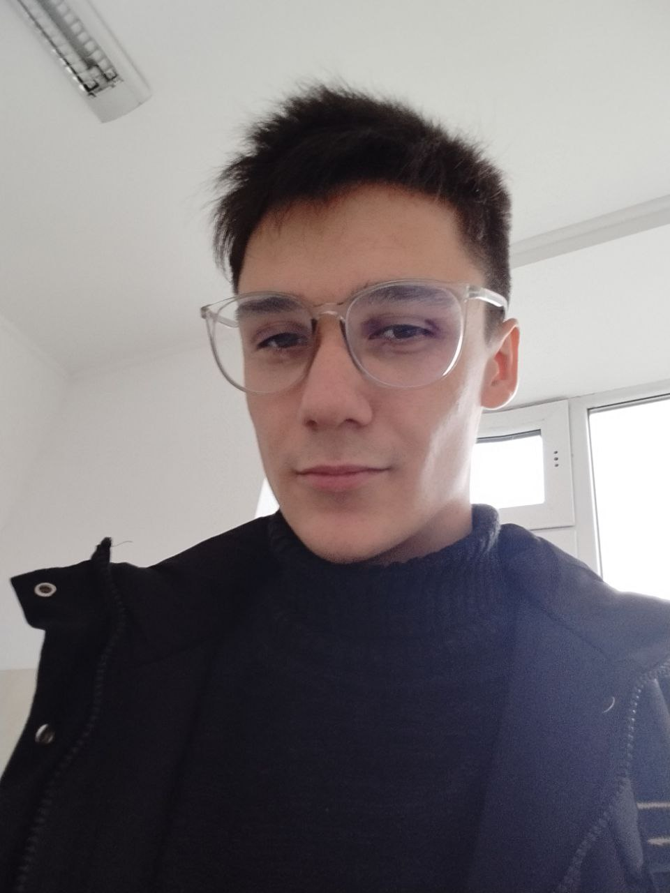

# 👋 Привет!

## 🧑‍💻 Обо мне
Меня зовут Сергей Северченко. Я занимаюсь веб-разработкой, дизайном и программированием. Имею опыт работы около 3 лет.

## 📸 Мой аватар

## 🚀 Области интересов
- Веб-разработка
- Backend / Frontend
- 3D моделирование
- Дизайн (Photoshop, Figma)
- Разработка игр

## 💻 Языки программирования

### Знаю:
- PHP
- JavaScript
- HTML/CSS

### Изучаю:
- Python
- Unity (C#)

### Хочу изучить:
- React
- Node.js

## 📬 Связь со мной
- Email: s.severchenko2004@gmail.com
- Телефон: 069095272